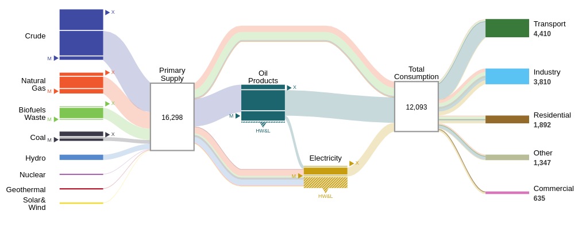

# IDB Energy visualizations
[](https://sonarcloud.io/dashboard?id=EL-BID_IDB-Energy-visualizations)


 

This software contains a set of interactive visualizations developped for the [Interamerican Development Bank](iadb.org) (roughly) from 2010 to 2015. It also contains data pertaining to characteristics of the energy sector in several countries and regions. Although most of the original data was collected from data published by the [IEA](https://www.iea.org/), these datasets were processed by economists and technical staff of the IDB.

**REMARK**: Biofuel data from 1971 to 2014 were randomized, following IDB recommendation, due to limitations on the agreement that restricts the publication of such information.

## Requirements

This repository can be installed as-is in any web server supporting PHP 7 or greater. 

## Installation

Copy all files in this repository to some directory, say, *bidvis*. After this, the main visualizations menu can be viewed by pointing your browser to *https://myserver.org/bidvis*. Also, since these visualizations were created using html5, a relatively modern browser supporting html5 technologies such as SVG, CSS and ES6 is required.

If you have PHP installed in your computer, a local server can be launched from terminal (or command prompt) by running the following commands, replacing /path/to/your/project with the real path where the repository was cloned (or unzipped):

```
cd /path/to/your/project
php -S localhost:9000 .
```

Once the PHP local server is ready to receive connections, just open your browser and enter the address http://localhost:9000.

## Team 

### Current Team

- Natacha Marzolf

- Michelle Carvalho Metanias Hallack

### Original IADB Content Team

- Ramon Espinasa

- Carlos Sucre

- Carlos Hinestrosa

- Lenin Balsa

### Original IADB Data Viz Project Team

 - Annette Hester - lead

- Veronica Prado - deputy

- Federica Bizzocchi - communications

- Eduardo Rodrigues - administration

### Universidade Federal do Rio de Janeiro LabVis

#### Graphic Design Team

- Doris Kosminsky

- Barbara Castro

- Gabriel Lira

- Mateus Knelsen 

#### Programming Team

- Claudio Esperanca

- Renato Campos Mauro

## License

This work is licensed under a Creative Commons IGO 3.0 - see the [LICENSE.md](LICENSE.md) file for details.
